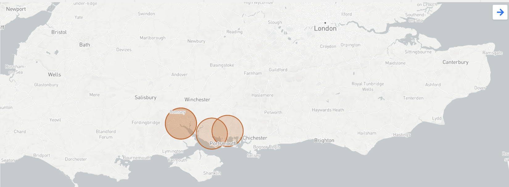
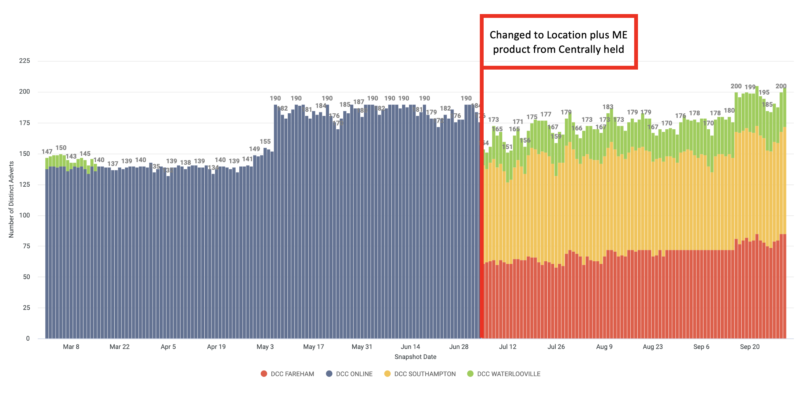

```{r read_data, include=FALSE}
knitr::opts_chunk$set(echo = TRUE, message=FALSE, warning=FALSE, fig.width = 10)


require(dplyr)
require(tidyr)
require(readr)
library(geosphere)
require(ggplot2)
require(knitr)
library(kableExtra)
library (rJava)
library (RJDBC)
library (bigQueryR)                     
library (googleAuthR)
library (bigrquery)
library (ggpubr)
library(leaflet)
library(rgdal)
library(reshape2)
library(data.table)
library(gridExtra)
library(plyr)
library(ggrepel)


dcc_sales_2021 <- read.csv('data/dcc_july_2021.csv')
all_dcc_sales <-  read.csv('data/all_dcc_sales.csv')


# advertised new cars by month from Looker:
# https://autotrader.eu.looker.com/explore/trusted/proxy_sold_data?qid=0O7XrY7RcOPAEeoKz6n31N&toggle=fil

# bigquery project settings
bqProject <- "at-data-platform-prod"
bqDataset <- "product"
bqBilling <- "at-data-platform-svc-prod"
connectToBigQuery <- function(project,dataset,billing){
  dbConnect(
    bigrquery::bigquery(),
    project = project,
    dataset = dataset,
    billing = billing
  )
}
con <- connectToBigQuery(project = bqProject, dataset = bqDataset, billing = bqBilling)
sql <- paste0(
  "

SELECT 
  sold_date as sold_date,
  sold.vrm as sold_vrm,
  sold.new_or_used as sold_new_or_used,
  sold.retailer_id as sold_did,
  sold.group_id as sold_gid,
  sold.retailer_latitude as sold_did_lat,
  sold.retailer_longitude as sold_did_lon,
  sold.retailer_postcode as sold_did_postcode,
  sold.make as sold_make,
  sold.model as sold_model,
  buyer.postcode_district as buyyer_postcode_district,
  buyer.latitude as buyer_lat,
  buyer.longitude buyer_lon,
  vrm_match_flag,
  did_make_model_match_flag as site_make_model_match_flag,
  did_make_match_flag as site_make_match_flag,
  did_match_flag as site_match_flag,
  group_make_model_match_flag,
  group_make_match_flag,
  group_match_flag,
  viewed.advert_price as viewed_advertised_price,
  viewed.vrm as viewed_vrm,
  viewed.event_date as viewed_event_date,
  viewed.retailer_id as viewed_did,
  viewed.group_id as viewed_gid,
  viewed.distance_between as viewed_distance_between,
  viewed.retailer_postcode as viewed_retailer_postcode,
  viewed.retailer_latitude as viewed_retailer_postcode,
  viewed.retailer_longitude as viewed_retailer_postcode
FROM `at-data-platform-prod.vehicle_sales.confirmed_sales_record_events` 
WHERE sold.group_id IN	('10023837')
  ")

d <- bq_dataset_query(
  con,
  query = sql, 
  billing = bqBilling
)

enhanced_match_base <- bq_table_download(d)
rm(con)

```
------------------------
**ME Locations**
[ME Locations] (https://autotrader.eu.looker.com/explore/customer_performance/retailer_performance?qid=UOGyp76yoNhXo6N30w1V43&toggle=dat,fil,vis,vse)

------------------------
**Me Product Timeline**
[ME Product Timeline] (https://autotrader.eu.looker.com/explore/customer_performance/retailer_performance?qid=EcNifiWF2u6fyJJYnUxWE7&toggle=fil,vis)

-------------------------------------------
**VRM Example - Direct Mqtch vs ME Match**
-------------------------------------------

```{r example_sale, echo= FALSE}
enhanced_match <- enhanced_match_base %>%
  mutate(me_vrm_match_flag = ifelse(sold_vrm == viewed_vrm, 1,0),
        site_all_match_flag = ifelse(site_make_model_match_flag + site_make_match_flag + site_make_match_flag >0,1,0),
        group_all_match_flag = ifelse(group_make_model_match_flag + group_make_match_flag + group_match_flag >0,1,0)
        ) %>%
        left_join(.,dcc_sales_2021, by = c('sold_vrm' = 'VRM'), copy = TRUE) %>%
        left_join(.,all_dcc_sales, by = c('sold_vrm' = 'VRM'), copy = TRUE)

enhanced_match$sold_month <- format(as.Date(enhanced_match$sold_date), "%Y-%m")
enhanced_match$Month_Yr <- NULL

# q1.how many sales did Auto Trader influence (split by the usual VRM, Site, Group level)
vrm_agg <- enhanced_match %>%
  group_by(sold_vrm,sold_month, viewed_distance_between, sold_make) %>%
  summarise(row_count = n(), 
            vrm_match_flag_sum = sum(vrm_match_flag, na.rm = TRUE),
            me_vrm_match_flag_sum = sum(me_vrm_match_flag, na.rm = TRUE)) %>%
  mutate(vrm_match_flag = ifelse(vrm_match_flag_sum >0 ,1,0),
         me_vrm_match_flag = ifelse(me_vrm_match_flag_sum >0 ,1,0))  

#CHECKING OUT SALE EXAMPLE
vrm_example <- enhanced_match %>%
  filter(sold_vrm == 'GU15MXO') %>%
  filter(viewed_did %in% c('10028897' , '10027421', '13281', '10024975'))


vrm_example %>%
  select(sold_vrm, buyyer_postcode_district, sold_did, viewed_did, viewed_event_date, me_vrm_match_flag) %>%
  kable("simple", col.names = c('sold vrm', 'buyer postcode district', 'sold did', 'viewed did','viewed date', 'me vrm match   flag'), align = "lccccc", format.args = list(big.mark = ",", scientific = FALSE))


```

---------------------------------
**How many sales did Auto Trader influence (split by the usual VRM, Site, Group level)**
---------------------------------

```{r match_sales}

vrm_agg <- enhanced_match %>%
  group_by(sold_month, sold_vrm) %>%
  summarise(row_count = n(), 
            vrm_match_flag_sum = sum(vrm_match_flag, na.rm = TRUE),
            me_vrm_match_flag_sum = sum(me_vrm_match_flag, na.rm = TRUE),
            site_match_flag_sum =  sum(site_all_match_flag, na.rm=TRUE),
            group_match_flag_sum = sum(group_all_match_flag, na.rm = TRUE)) %>%
          mutate(vrm_match_flag = ifelse(vrm_match_flag_sum >0 ,1,0),
            me_vrm_match_flag = ifelse(me_vrm_match_flag_sum >0 ,1,0),
            site_match_flag = ifelse(site_match_flag_sum >0, 1,0),
            group_match_flag = ifelse(group_match_flag_sum >0, 1,0),
            no_match_flag = ifelse((me_vrm_match_flag +site_match_flag + group_match_flag) >0, 0, 1))


matches <- vrm_agg %>%
          group_by(sold_month) %>%
          summarise(vrm_matches = sum(vrm_match_flag, na.rm = TRUE),
                    me_vrm_matches = sum(me_vrm_match_flag, na.rm= TRUE),
                    site_matches =  sum(site_match_flag, na.rm=TRUE),
                    group_matches = sum(group_match_flag, na.rm = TRUE),
                    no_matches = sum(no_match_flag, na.rm = TRUE))


matches_m <- melt(matches[,c('sold_month', 'no_matches', 'me_vrm_matches','site_matches', 'group_matches')],id.vars = 1)


ggplot(matches_m,aes(x = sold_month,y = value)) + 
    geom_bar(aes(fill = variable),stat = "identity",position = "stack") + theme_minimal() + scale_fill_brewer() + labs(title = "Autotrader Influence") + labs(x = expression("Month"), y = "Influence")

```
-------------------------------------
**What is the total value/profit of cars sold through Market Extension**
-------------------------------------
```{r profit, echo = TRUE}

#total value profit - create a distance banding
enhanced_match <- enhanced_match %>%
        mutate(viewed_distance_banding = ifelse(viewed_distance_between <10, "less than 10 miles",
                                         ifelse(viewed_distance_between <20, "less than 20 miles",
                                         ifelse(viewed_distance_between <50, "less than 50 miles",
                                         ifelse(viewed_distance_between <100, "less than 100 miles", "100 or more miles")))),
               value_added_products = ifelse(Value.added.Products >0, 1,0)) 
                 
                 

enhanced_match$viewed_distance_banding <- factor(enhanced_match$viewed_distance_banding, levels = c("less than 10 miles", "less than 20 miles", "less than 50 miles", "less than 100 miles", "100 or more miles"), ordered = TRUE)


profit_agg <- enhanced_match %>%
            filter(me_vrm_match_flag == 1) %>%
            group_by(viewed_distance_banding) %>%
            summarise(row_count = n(),
                      distinct_sales = n_distinct(sold_vrm),
                      avg_profit = mean(Chassis.Margin, na.rm = TRUE))
                      

barplot(profit_agg$avg_profit, names.arg = profit_agg$viewed_distance_banding, col = 'steelblue', main = "Avg profit by distance - enriched data July 2021", xlab = "Distance Banding", ylab = 'Mean Profit' )


```
-------------------------------------
**What is the total value/profit of cars sold through Market Extension - product add ons**
-------------------------------------

```{r finance, echo = TRUE}

has_finance <- enhanced_match %>%
            filter(value_added_products == 1) %>%
            filter(me_vrm_match_flag == 1) %>%
            group_by(viewed_distance_banding) %>%
            summarise(row_count = n(),
                      distinct_sales = n_distinct(sold_vrm),
                      avg_profit = mean(Chassis.Margin, na.rm = TRUE))

no_finance <- enhanced_match %>%
            filter(value_added_products == 0) %>%
            filter(me_vrm_match_flag == 1) %>%
            group_by(viewed_distance_banding) %>%
            summarise(row_count = n(),
                      distinct_sales = n_distinct(sold_vrm),
                      avg_profit = mean(Chassis.Margin, na.rm = TRUE))


par(mfrow = c(2,1))
prof_1 <- barplot(has_finance$avg_profit, names.arg = has_finance$viewed_distance_banding, col = 'steelblue', main = "Avg profit by distance with value added products - enriched data July 2021", xlab = "Distance Banding", ylab = 'Mean Profit' )
                      

prof_2 <- barplot(no_finance$avg_profit, names.arg = no_finance$viewed_distance_banding, col = 'steelblue', main = "Avg profit by distance no value added products- enriched data July 2021", xlab = "Distance Banding", ylab = 'Mean Profit' )

par(mfrow = c(1,1))

```
 
**How far away is the buyer to the seller?**

```{r distance, echo= TRUE}


distance_agg <- enhanced_match %>%
group_by(sold_month, sold_vrm) %>%
  
  summarise(row_count = n(), 
            less_than_10_miles_sum = sum(viewed_distance_banding == 'less than 10 miles', na.rm = TRUE),
            less_than_20_miles_sum = sum(viewed_distance_banding == 'less than 20 miles', na.rm = TRUE),
            less_than_50_miles_sum = sum(viewed_distance_banding == 'less than 50 miles', na.rm = TRUE),
            less_than_100_miles_sum = sum(viewed_distance_banding == 'less than 100 miles', na.rm = TRUE),
            onehundered_or_more_miles_sum = sum(viewed_distance_banding == '100 or more miles', na.rm = TRUE)) %>%
          mutate(less_10_miles_match = ifelse(less_than_10_miles_sum >0 ,1,0),
                less_20_miles_match = ifelse(less_than_20_miles_sum >0 ,1,0), 
                less_50_miles_match = ifelse(less_than_50_miles_sum >0 ,1,0),
                less_100_miles_match = ifelse(less_than_100_miles_sum >0 ,1,0),
                onehundred_or_more_miles_match = ifelse(onehundered_or_more_miles_sum >0 ,1,0))

distance_bandings <- distance_agg %>%
                  group_by(sold_month) %>%
                  summarise(less_than_10_miles = sum(less_10_miles_match, na.rm = TRUE),
                    less_than_20_miles = sum(less_20_miles_match, na.rm= TRUE),
                    less_than_50_miles =  sum(less_50_miles_match, na.rm=TRUE),
                    less_than_100_miles = sum(less_100_miles_match, na.rm = TRUE),
                    onehundred_or_more_miles = sum(onehundred_or_more_miles_match, na.rm = TRUE))
              


distance_bandings_m <- melt(distance_bandings[,c('sold_month', 'less_than_10_miles','less_than_20_miles', 'less_than_50_miles', 'less_than_100_miles', 'onehundred_or_more_miles')],id.vars = 1)


p1 <- ggplot(distance_bandings_m,aes(x = sold_month,y = value)) + 
    geom_bar(aes(fill = variable),stat = "identity",position = "stack") + theme_minimal() + scale_fill_brewer() + labs(title = "Viewed distance banding") + labs(x = expression("Month"), y = "banding")


p2 <- ggplot(distance_bandings_m) + 
    geom_col(aes(x = sold_month, y = value, fill = variable), position = "fill") +scale_fill_brewer()


ggplot(distance_bandings_m, aes(y=value, x=sold_month, fill= variable)) +
  geom_bar(stat = "identity", position = "fill") +
  geom_text(aes(label = value), ) +
  ylab("percent of sold vrms") +
  scale_fill_discrete(name="Distance Bandings") +
  xlab("Sold Month")


distance_bandings_m <- ddply(distance_bandings_m, .(sold_month), transform, percent = value/sum(value) * 100)
distance_bandings_m <- ddply(distance_bandings_m, .(sold_month), transform, pos = (cumsum(value) - 0.5 * value))
distance_bandings_m$label = paste0(sprintf("%.0f", distance_bandings_m$percent), "%")

ggplot(distance_bandings_m, aes(x=factor(sold_month), y = percent, fill = variable))+
   geom_bar(position = position_stack(), stat = "identity", width = .7) +
   geom_text(aes(label = label), position = position_stack(vjust = 0.5), size = 2)

  #
```

------------------------
**How does distance between buyer & seller vary by sold vehicle type (e.g. standard vs. premium)?**
------------------------

```{r standard_premium, echo = TRUE}
premium_standard <- enhanced_match %>%
                    mutate(type_of_stock = ifelse(sold_make %in% c('BMW', 'Audi', 'Jaguar', 'Land Rover', 'Mercedes-Benz', 'MINI', 'Jeep', 'Alfa Romeo'), "premium",
                                           ifelse(sold_make %in% c('Citroen', 'Peugeot', 'Vauxhall', 'Hyundai', 'Kia', 'Nissan', "Volkswagen", 'Peugeot', 'Renault', 'Ford', 'Hyundai','Toyota', 'Volvo', 'Mazda', 'SEAT', 'Dacia', 'SKODA', 'Suzuki', 'DS AUTOMOBILES', 'Mitsubishi', 'Smart', 'Honda'), "standard", "other")))


premium_standard_agg <- premium_standard %>%
  group_by(type_of_stock, sold_month, sold_vrm) %>%
  summarise(row_count = n(), 
            less_than_10_miles_sum = sum(viewed_distance_banding == 'less than 10 miles', na.rm = TRUE),
            less_than_20_miles_sum = sum(viewed_distance_banding == 'less than 20 miles', na.rm = TRUE),
            less_than_50_miles_sum = sum(viewed_distance_banding == 'less than 50 miles', na.rm = TRUE),
            less_than_100_miles_sum = sum(viewed_distance_banding == 'less than 100 miles', na.rm = TRUE),
            onehundered_or_more_miles_sum = sum(viewed_distance_banding == '100 or more miles', na.rm = TRUE)) %>%
          mutate(less_10_miles_match = ifelse(less_than_10_miles_sum >0 ,1,0),
                less_20_miles_match = ifelse(less_than_20_miles_sum >0 ,1,0), 
                less_50_miles_match = ifelse(less_than_50_miles_sum >0 ,1,0),
                less_100_miles_match = ifelse(less_than_100_miles_sum >0 ,1,0),
                onehundred_or_more_miles_match = ifelse(onehundered_or_more_miles_sum >0 ,1,0))


type_stock_distance_bandings <- premium_standard_agg %>%
                             group_by(type_of_stock, sold_month) %>%
                             summarise(less_than_10_miles = sum(less_10_miles_match, na.rm = TRUE),
                              less_than_20_miles = sum(less_20_miles_match, na.rm= TRUE),
                              less_than_50_miles =  sum(less_50_miles_match, na.rm=TRUE),
                              less_than_100_miles = sum(less_100_miles_match, na.rm = TRUE),
                              onehundred_or_more_miles = sum(onehundred_or_more_miles_match, na.rm = TRUE))


type_stock_distance_bandings_m <- melt(type_stock_distance_bandings[,c('type_of_stock','less_than_10_miles','less_than_20_miles', 'less_than_50_miles', 'less_than_100_miles', 'onehundred_or_more_miles')],id.vars = 1)


test_m <- melt(setDT(type_stock_distance_bandings), id.vars ="type_of_stock")


ggplot(type_stock_distance_bandings_m,aes(x = type_of_stock,y = value)) + 
    geom_bar(aes(fill = variable),stat = "identity",position = "stack") + theme_minimal() + scale_fill_brewer() + labs(title = "Viewed distance banding") + labs(x = expression("type_of_stock"), y = "viewed_distance")

 


#panel plot one chart standard one premium
```

------------------------
**How does influence rate between buyer & seller vary by sold vehicle type (e.g. standard vs. premium)?**
------------------------

```{r standard_premium_matches, echo = TRUE}

premium_standard_agg <- premium_standard %>%
  group_by(type_of_stock, sold_month, sold_vrm) %>%
  summarise(row_count = n(), 
            vrm_match_flag_sum = sum(vrm_match_flag, na.rm = TRUE),
            me_vrm_match_flag_sum = sum(me_vrm_match_flag, na.rm = TRUE),
            site_match_flag_sum =  sum(site_make_model_match_flag + site_make_match_flag + site_make_match_flag , na.rm=TRUE),
            group_match_flag_sum = sum(group_make_model_match_flag + group_make_match_flag + group_match_flag, na.rm = TRUE)) %>%
          mutate(vrm_match_flag = ifelse(vrm_match_flag_sum >0 ,1,0),
            me_vrm_match_flag = ifelse(me_vrm_match_flag_sum >0 ,1,0),
            site_match_flag = ifelse(site_match_flag_sum >0, 1,0),
            group_match_flag = ifelse(group_match_flag_sum >0, 1,0),
            no_match_flag = ifelse((me_vrm_match_flag +site_match_flag + group_match_flag) >0, 0, 1))


premium_standard_matches <- premium_standard_agg %>%
                            group_by(type_of_stock, sold_month) %>%
                            summarise(vrm_matches = sum(vrm_match_flag, na.rm = TRUE),
                               me_vrm_matches = sum(me_vrm_match_flag, na.rm= TRUE),
                               site_matches =  sum(site_match_flag, na.rm=TRUE),
                               group_matches = sum(group_match_flag, na.rm = TRUE),
                               no_matches = sum(no_match_flag, na.rm = TRUE))

premium_standard_matches_m <- melt(premium_standard_matches[,c('type_of_stock', 'me_vrm_matches','site_matches', 'group_matches', 'no_matches')],id.vars = 1)


 
ggplot(premium_standard_matches_m) + 
    geom_col(aes(x = type_of_stock, y = value, fill = variable), position = "fill") +scale_fill_brewer()


```
  
  
  
  
                          