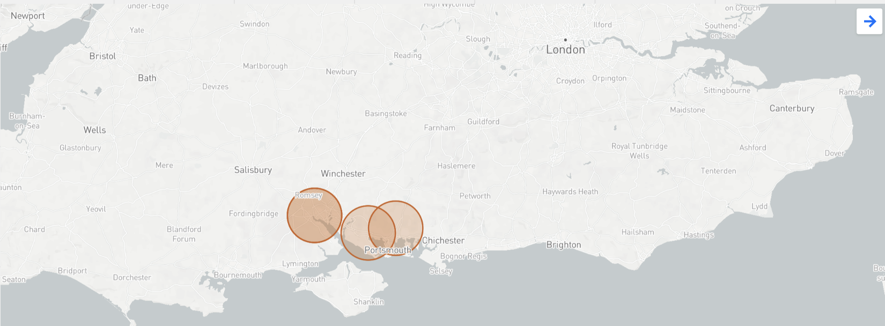
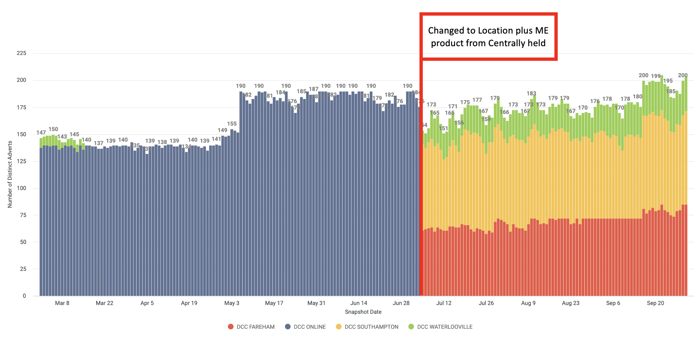

```{r read_data, include=FALSE}
knitr::opts_chunk$set(echo = TRUE, message=FALSE, warning=FALSE, fig.width = 10)

require(dplyr)
require(tidyr)
require(readr)
library(geosphere)
require(ggplot2)
library(maps)
require(knitr)
library(kableExtra)
library (rJava)
library (RJDBC)
library (bigQueryR)                     
library (googleAuthR)
library (bigrquery)
library (ggpubr)
library(leaflet)
library(rgdal)
library(reshape2)
library(data.table)
library(gridExtra)
library(ggrepel)


dcc_sales_2021 <- read.csv('data/dcc_july_2021.csv')
# all_dcc_sales <-  read.csv('data/all_dcc_sales.csv')


# advertised new cars by month from Looker:
# https://autotrader.eu.looker.com/explore/trusted/proxy_sold_data?qid=0O7XrY7RcOPAEeoKz6n31N&toggle=fil

# bigquery project settings
bqProject <- "at-data-platform-prod"
bqDataset <- "product"
bqBilling <- "at-data-platform-svc-prod"
connectToBigQuery <- function(project,dataset,billing){
  dbConnect(
    bigrquery::bigquery(),
    project = project,
    dataset = dataset,
    billing = billing
  )
}
con <- connectToBigQuery(project = bqProject, dataset = bqDataset, billing = bqBilling)
sql <- paste0(
  "

SELECT 
  sold_date as sold_date,
  sold.vrm as sold_vrm,
  sold.new_or_used as sold_new_or_used,
  sold.retailer_id as sold_did,
  sold.group_id as sold_gid,
  sold.retailer_latitude as sold_did_lat,
  sold.retailer_longitude as sold_did_lon,
  sold.retailer_postcode as sold_did_postcode,
  sold.make as sold_make,
  sold.model as sold_model,
  buyer.postcode_district as buyyer_postcode_district,
  buyer.latitude as buyer_lat,
  buyer.longitude buyer_lon,
  vrm_match_flag,
  did_make_model_match_flag as site_make_model_match_flag,
  did_make_match_flag as site_make_match_flag,
  did_match_flag as site_match_flag,
  group_make_model_match_flag,
  group_make_match_flag,
  group_match_flag,
  viewed.advert_price as viewed_advertised_price,
  viewed.vrm as viewed_vrm,
  viewed.event_date as viewed_event_date,
  viewed.retailer_id as viewed_did,
  viewed.group_id as viewed_gid,
  viewed.distance_between as viewed_distance_between,
  viewed.retailer_postcode as viewed_retailer_postcode,
  viewed.retailer_latitude as viewed_retailer_postcode,
  viewed.retailer_longitude as viewed_retailer_postcode
FROM `at-data-platform-prod.vehicle_sales.confirmed_sales_record_events` 
WHERE sold.group_id IN	('10023837')
  ")

d <- bq_dataset_query(
  con,
  query = sql, 
  billing = bqBilling
)

enhanced_match_base <- bq_table_download(d)
rm(con)

```
------------------------
**Purpose of analysis**
Enhanced match data to investigate changes determined by switching from Centrally Held Market Extension product to the Location Plus product.
------------------------


**ME Locations**
[ME Locations] (https://autotrader.eu.looker.com/explore/customer_performance/retailer_performance?qid=UOGyp76yoNhXo6N30w1V43&toggle=dat,fil,vis,vse)


Currently locations are closely grouped together in the South East region of the UK.


------------------------
**Me Product Timeline**
------------------------
[ME Product Timeline] (https://autotrader.eu.looker.com/explore/customer_performance/retailer_performance?qid=EcNifiWF2u6fyJJYnUxWE7&toggle=fil,vis)
{width=800px}


Above is a timeline of stock on the Market Extension, centrally held stock on 'DCC Online' until June 2021 then moving onto the Location Plus product.

-------------------------------------------
**VRM Example - Direct Match vs ME Match**
-------------------------------------------

```{r example_sale, echo= FALSE}

################## TEMP TO CHECK SOME EXAMPLES FOR THE DATA PREP  -----------

# events of a simple buyer journey
# enhanced_match_base %>% group_by(sold_vrm) %>% summarise(count = n(), matches = sum(group_make_model_match_flag + group_make_match_flag + group_match_flag )) %>% View()
# View(enhanced_match_base %>% filter(sold_vrm == "LS13UYV"))
# 
# enhanced_match %>% group_by(sold_vrm) %>% summarise(count = n(), matches = sum(group_make_model_match_flag + group_make_match_flag + group_match_flag )) %>% View()
# View(enhanced_match %>% filter(sold_vrm == "LS13UYV"))

################## TEMP TO CHECK SOME EXAMPLES FOR THE DATA PREP  -----------


# create new variables
enhanced_match <- enhanced_match_base %>%
  mutate(me_vrm_match_flag = ifelse(sold_vrm == viewed_vrm, 1,0),
        site_all_match_flag = ifelse(site_make_model_match_flag + site_make_match_flag + site_make_match_flag >0,1,0),
        group_all_match_flag = ifelse(group_make_model_match_flag + group_make_match_flag + group_match_flag >0,1,0),
        type_of_stock = ifelse(sold_make %in% c('BMW', 'Audi', 'Jaguar', 'Land Rover', 'Mercedes-Benz', 'MINI', 'Jeep', 'Alfa Romeo'), "premium",
                                           ifelse(sold_make %in% c('Citroen', 'Peugeot', 'Vauxhall', 'Hyundai', 'Kia', 'Nissan', "Volkswagen", 'Peugeot', 'Renault', 'Ford', 'Hyundai','Toyota', 'Volvo', 'Mazda', 'SEAT', 'Dacia', 'SKODA', 'Suzuki', 'DS AUTOMOBILES', 'Mitsubishi', 'Smart', 'Honda'), "standard", "other"))
        ) %>%
        left_join(.,dcc_sales_2021, by = c('sold_vrm' = 'VRM'), copy = TRUE)
        

        # left_join(.,all_dcc_sales, by = c('sold_vrm' = 'VRM'), copy = TRUE)

enhanced_match$sold_month <- format(as.Date(enhanced_match$sold_date), "%Y-%m")

# replxce NA with 0 on attribution flags else casues problems when summarising further down the line
enhanced_match[c("vrm_match_flag", "site_all_match_flag", "group_all_match_flag", "me_vrm_match_flag")][is.na(enhanced_match[c("vrm_match_flag", "site_all_match_flag", "group_all_match_flag", "me_vrm_match_flag")])] <- 0

# q1.how many sales did Auto Trader influence (split by the usual VRM, Site, Group level)

#CHECKING OUT SALE EXAMPLE
vrm_example <- enhanced_match %>%
  filter(sold_vrm == 'GU15MXO') %>%
  filter(viewed_did %in% c('10028897' , '10027421', '13281', '10024975'))


vrm_example %>%
  select(sold_vrm, buyyer_postcode_district, sold_did, viewed_vrm, viewed_did, viewed_event_date, me_vrm_match_flag) %>%
  kable("simple", col.names = c('sold vrm', 'buyer postcode district', 'sold did','viewed vrm', 'viewed did','viewed date', 'me vrm match flag'), align = "lcccccc", format.args = list(big.mark = ",", scientific = FALSE))


```
**map view of vrm me matches**

```{r mapview}


vrm_example_map <- vrm_example %>%
  filter(me_vrm_match_flag == 1) %>%
  select(sold_vrm, sold_did, sold_did_lat, sold_did_lon, sold_did_postcode, buyyer_postcode_district, buyer_lat, buyer_lon, viewed_vrm, viewed_did, viewed_retailer_postcode, viewed_retailer_postcode_1, viewed_retailer_postcode_2, viewed_distance_between) 


worldmap = map_data('world')

ggplot() + 
  geom_polygon(data = worldmap, 
               aes(x = long, y = lat, 
                   group = group), 
               fill = 'gray90', 
               color = 'black') + 
  coord_fixed(ratio = 1.3, 
              xlim = c(-5,1), 
              ylim = c(50, 55)) + 
  theme_void() + 
  geom_point(data = vrm_example_map, aes(x = sold_did_lon, y = sold_did_lat, size = 0.5, col = "darkred")) +
  geom_point(data = vrm_example_map, aes(x = viewed_retailer_postcode_2, y = viewed_retailer_postcode_1, size = 0.5, col = "blue")) + 
  geom_point(data = vrm_example_map, aes(x = buyer_lon, y = buyer_lat, size = 0.5, col = "green")) + theme(legend.position="none")


```

```{r vrm_summary}

# Create a vrm level summary of the events level data for analysis
vrm_agg <- enhanced_match %>%
            group_by(sold_vrm, sold_month, sold_make, type_of_stock) %>%
            mutate(value_added_products = ifelse(Value.added.Products >0, 1,0),
           matched_viewed_distance_between = ifelse( (me_vrm_match_flag + site_all_match_flag + group_all_match_flag) > 0, viewed_distance_between, NA)
              )%>%
            summarise(row_count = n(),
                      me_vrm_match_flag = max(me_vrm_match_flag, na.rm = TRUE),
                      site_match_flag = max(site_all_match_flag, na.rm = TRUE),
                      group_match_flag = max(group_all_match_flag, na.rm = TRUE),
                      matched_viewed_distance_between = mean(matched_viewed_distance_between, na.rm=T),
                      profit_margin = mean(Chassis.Margin, na.rm=T),
                      value_added_products_flag = max(value_added_products)
                      ) %>%
            mutate(site_match_flag = ifelse(me_vrm_match_flag == 1 ,0, site_match_flag),
                  group_match_flag = ifelse( (site_match_flag == 1) | (me_vrm_match_flag == 1) ,0, group_match_flag),
                  no_match_flag = ifelse((me_vrm_match_flag + site_match_flag + group_match_flag) >0, 0, 1),
                  )

# replace NA with no match as this is a legit banding - if no match then ther is no distanc, so still want to include this in charts
vrm_agg$matched_viewed_distance_between[is.nan(vrm_agg$matched_viewed_distance_between)]<- -1

# create distance banding and turn into factor so shows in right order on charts
vrm_agg <- vrm_agg %>%
        mutate(viewed_distance_banding = ifelse(matched_viewed_distance_between == -1, "No match",
                                         ifelse(matched_viewed_distance_between <10, "less than 10 miles",
                                         ifelse(matched_viewed_distance_between <20, "less than 20 miles",
                                         ifelse(matched_viewed_distance_between <50, "less than 50 miles",
                                         ifelse(matched_viewed_distance_between <100, "less than 100 miles",
                                         ifelse(matched_viewed_distance_between >=100, "100 or more miles" 
                                                )))))))

#  convert to factore with levels
vrm_agg$viewed_distance_banding <- factor(vrm_agg$viewed_distance_banding, levels = c("less than 10 miles", "less than 20 miles", "less than 50 miles", "less than 100 miles", "100 or more miles", 'No match'), ordered = TRUE)


# change back ***SKANKY, NEED TO FIND BETTER WASY TO DO THIS!!!! ***
vrm_agg$matched_viewed_distance_between[vrm_agg$matched_viewed_distance_between == -1]<- NaN


```


---------------------------------
**How many sales did Auto Trader influence (split by the usual VRM, Site, Group level)**
After the switch to location + in July 2021 ME vrm matches greatly increased for DCC Sales
---------------------------------

```{r match_sales}


matches <- vrm_agg %>%
          group_by(sold_month) %>%
          summarise(me_vrm_matches = sum(me_vrm_match_flag, na.rm= TRUE),
                    site_matches =  sum(site_match_flag, na.rm=TRUE),
                    group_matches = sum(group_match_flag, na.rm = TRUE),
                    no_matches = sum(no_match_flag, na.rm = TRUE))


matches_m <- melt(matches[,c('sold_month', 'no_matches', 'group_matches','site_matches', 'me_vrm_matches')],id.vars = 1)


ggplot(matches_m,aes(x = sold_month,y = value)) + 
    geom_bar(aes(fill = variable),stat = "identity",position = "stack") + theme_minimal() + scale_fill_brewer() + labs(title = "Autotrader Influence") + labs(x = expression("Month"), y = "Influence")

```

Group matches for May and June 2021 are currently not correct, work is going on to fix this and we expect group matches to be higher. July 2021 sold vehicles is much higher due to increased stock in that particular month.

------------------------------------------
**How far away is the buyer to the seller?**
------------------------------------------

```{r distance, echo= TRUE}

# create distance aggregation to show how distance buyer travels changes over time
distance_matches <- vrm_agg %>%
                      filter(!is.na(viewed_distance_banding)) %>%
                      group_by(sold_month, viewed_distance_banding) %>%
                      summarise(me_vrm_matches = sum(me_vrm_match_flag, na.rm= TRUE),
                                site_matches =  sum(site_match_flag, na.rm=TRUE),
                                group_matches = sum(group_match_flag, na.rm = TRUE),
                                no_matches = sum(no_match_flag, na.rm = TRUE))

# melt to in right format for plotting

distance_matches_m <- melt(distance_matches[,c('sold_month', 'viewed_distance_banding', 'me_vrm_matches', 'site_matches', 'group_matches', 'no_matches')],id.vars = c(1,2))


# create barplot

tmp <- distance_matches_m %>% group_by(sold_month) %>% summarise(monthly_total = sum(value, na.rm=T))
distance_matches_m_agg <- left_join(distance_matches_m, tmp, by = c('sold_month'), copy=T)
distance_matches_m_agg <- distance_matches_m_agg %>%
                            ungroup() %>%
                            group_by(sold_month, viewed_distance_banding) %>% 
                              summarise(percent = sum(value, na.rm=T)/monthly_total)

ggplot(distance_matches_m_agg,aes(x = sold_month,y = percent)) + 
    geom_bar(aes(fill = forcats::fct_rev(viewed_distance_banding)),stat = "identity",position = "fill") + theme_minimal() + scale_fill_brewer() + labs(title = "% of sales by distance banding") + labs(x = expression("Month"), y = "Influence") + geom_text(aes(label=distance_matches_m_agg$percent, y=distance_matches_m_agg$percent/100))


```

-------------------------------------
**Profit by Distance Sold - July 2021 Data**
-------------------------------------
```{r profit, echo = TRUE}


profit_agg <- vrm_agg %>%
            filter(no_match_flag == 0) %>%
            group_by(viewed_distance_banding) %>%
            summarise(row_count = n(),
                      distinct_sales = n_distinct(sold_vrm),
                      avg_profit = mean(profit_margin, na.rm = TRUE))


#hist(vrm_agg$profit_margin, col = 'skyblue3', breaks = 20, xlab = 'profit margin', main = "Avg profit distribution")
par(mai=c(1,2,1,1))
barplot(profit_agg$avg_profit, names.arg = profit_agg$viewed_distance_banding, col="dodgerblue3",
        density=c(30,10,20,35,15,25),angle=60, main = "Avg profit by distance", xlab = "Mean Profit(£)" , cex.names=0.7, horiz = TRUE, las=1)


```

-------------------------------------
**What is the total value/profit of cars sold through Market Extension - product add ons**
Looking at the enriched profit data for July the cars sold with 'add ons' (finance etc) those without add ons appears to have a higher average profit
-------------------------------------

```{r finance, echo = TRUE}

has_finance <- vrm_agg %>%
            group_by(viewed_distance_banding) %>%
            filter(value_added_products_flag == 1) %>%
            summarise(distinct_sales = n_distinct(sold_vrm))


no_finance <- vrm_agg %>%
            group_by(viewed_distance_banding) %>%
            filter(value_added_products_flag == 0) %>%
            summarise(distinct_sales = n_distinct(sold_vrm))


par(mfrow=c(1,2))
barplot(has_finance$distinct_sales, names.arg = has_finance$viewed_distance_banding, col = 'steelblue', main = "Add Ons", xlab = "Distance Banding", ylab = 'distinct sales' )
barplot(no_finance$distinct_sales, names.arg = no_finance$viewed_distance_banding, col = 'steelblue', main = "No Add Ons", xlab = "Distance Banding", ylab = 'distinct sales' )


par(mfrow=c(1,1))

```

------------------------
**How does distance between buyer & seller vary by sold vehicle type (e.g. standard vs. premium)?**
Premium vehicle sales are likely to come from 21-50 miles, whereas standard vehicles are being purchased from further.
------------------------

```{r standard_premium, echo = TRUE}


premium_standard_matches <- vrm_agg %>%
                      filter(type_of_stock %in% c('standard', 'premium')) %>%
                      group_by(sold_month, viewed_distance_banding, type_of_stock) %>%
                      summarise(me_vrm_matches = sum(me_vrm_match_flag, na.rm= TRUE),
                                site_matches =  sum(site_match_flag, na.rm=TRUE),
                                group_matches = sum(group_match_flag, na.rm = TRUE),
                                no_matches = sum(no_match_flag, na.rm = TRUE))

# melt to in right format for plotting
premium_standard_matches_m <- melt(premium_standard_matches[,c('sold_month','viewed_distance_banding', 'type_of_stock', 'no_matches', 'group_matches','site_matches', 'me_vrm_matches')],id.vars = c(1,2,3))

# create barplot
ggplot(premium_standard_matches_m,aes(x = sold_month,y = value)) + 
    geom_bar(aes(fill = forcats::fct_rev(viewed_distance_banding)),stat = "identity",position = "fill") + theme_minimal() + scale_fill_brewer() + labs(title = "Distance Banding") + labs(x = expression("Month"), y = "Influence")+ facet_grid(cols = vars(type_of_stock))


```

------------------------
**How does influence rate between buyer & seller vary by sold vehicle type (e.g. standard vs. premium)?**
------------------------

```{r standard_premium_matches, echo = TRUE}

ggplot(premium_standard_matches_m,aes(x = sold_month,y = value)) + 
    geom_bar(aes(fill = variable),stat = "identity",position = "fill") + theme_minimal() + scale_fill_brewer() + labs(title = "Autotrader Influence") + labs(x = expression("Month"), y = "Influence")+ facet_grid(cols = vars(type_of_stock))


```
  
  
  
  
                          